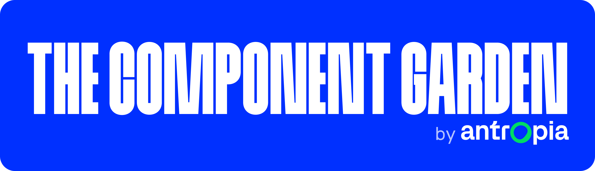
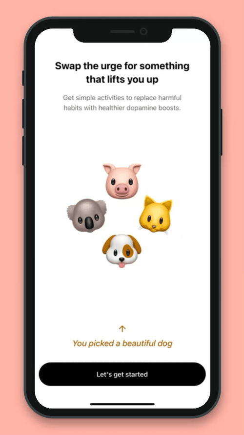
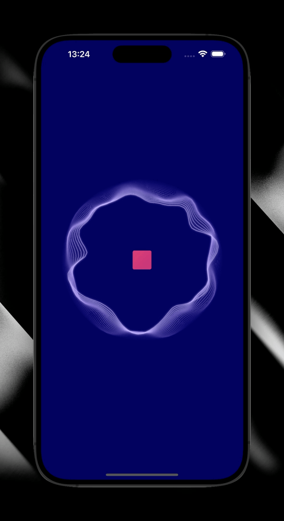

<div align="center">



**Welcome to The Component Garden! This is our playground to build new React Native components.**



</div>

## What is it?

Because we want to keep things fun and experimental in here, we have set some rules to ourselves for this project that are
worth mentioning:

- **A project to learn**. This project is our personal lab, to explore new user interactions, implement new animations, and master React Native.
- **Sharing knowledge**. A big part of our experiments is to share our findings with the community. This repository is the main piece of that.
- **Low maintenance**. This is not a production-ready set of components you can quickly add to your own apps, or maybe they are! However, keep in mind this will not be our main focus. We will accept PRs for bug fixes or adding some new props you really need for your project, but maintenance of the components will not be our priority.

> [!IMPORTANT]
> Use the code in this repository for curiosity, learning and reference, but not for production.

## Project structure

The project is structured as follows:

```
TheComponentGarden
├─ example  # Example app for development and showcasing
├─ lib      # Reusable code
└─ packages # Exported component packages
```

All packages are published to NPM under the `@antropia` organization, and all of them have follow the same naming pattern: `@antropia/the-component-garden-*`.

## Packages

This is a list of the different components we have developed so far.

| Component      | Tags                                         | Example                                             |
|----------------|----------------------------------------------|-----------------------------------------------------|
| card-deck      | `Drag&Drop`, `Gesture Handler`, `Reanimated` |       |
| recording-wave | `Expo Audio`, `Skia`, `Reanimated`           |  |

## Development

We use [`pnpm`](https://pnpm.io/) to manage this monorepo and its dependencies. If you want to play with these components, make sure you install all required dependencies first by running:

```shell
pnpm install
```

From then on, you can run the example app by running:

```shell
pnpm run example:ios     # For iOS
pnpm run example:android # For Android
```

The project uses [biome](https://biomejs.dev/) for linting and formatting, so make sure you have it integrated with your IDE for great DX.

## Writeups

- [The Component Garden: Card Deck](https://antropia.studio/blog/the-component-garden/)

---

<div align="center">

## With ❤️ by Antropia

[Webpage](https://antropia.studio/) | [Blog](https://antropia.studio/blog/) | [Bluesky](https://bsky.app/profile/antropia.bsky.social) | [Mastodon](https://mstdn.social/@Antropia) | [TikTok](https://www.tiktok.com/@antropiastudio) | [LinkedIn](https://www.linkedin.com/company/antropia-studio/)

</div>
